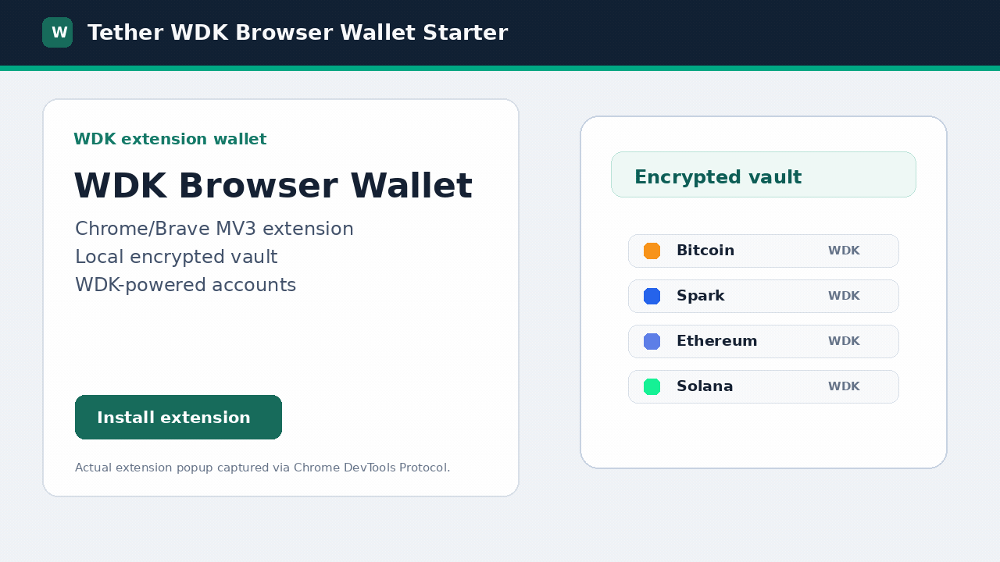

# WDK Browser Extension Starter

Chrome/Brave browser extension wallet starter built with Tether Wallet Development Kit (WDK), WXT, React, and TypeScript.

This starter demonstrates extension packaging, encrypted local vault storage, wallet keys confined to the background service worker, popup wallet flows, origin-scoped EIP-1193/EIP-6963 dApp connections, example transaction approval paths, and WDK module registration for the configured networks.

## White-Label Showcase

This project is **MIT-licensed open source** (see [`LICENSE`](LICENSE)). A standalone static UI showcase lives in [`website/`](website/) and can be hosted independently of the extension build.

The showcase is UI only: it does not import extension runtime code and never handles wallet secrets. It includes the design system, interactive prototype, and 12 ready-made skins driven by one theme engine. The Pages workflow in [`.github/workflows/pages.yml`](.github/workflows/pages.yml) uploads only `website/`, after the shared dependency gate passes for the same commit.



Demo video: [`docs/showcase-video.mp4`](docs/showcase-video.mp4) (2m24s, 1920x1080).

## Features

| Area | Implementation |
| --- | --- |
| Chrome/Brave extension wallet | Manifest V3 extension built with WXT |
| Popup UI | React popup in `src/ui` |
| Background scripts | `entrypoints/background.ts` runs the wallet controller |
| Message passing | content/inpage/background bridge in `entrypoints/content.ts` and `entrypoints/inpage.ts` |
| Secure storage | AES-256-GCM vault with PBKDF2-SHA256, stored in `browser.storage.local` |
| Seed generation/recovery/validation | BIP-39 generation and validation in `src/lib/crypto/vault.ts`, with create-time recovery phrase backup confirmation and import validation in onboarding UI |
| Password lock/session timeout | in-memory session with 10-minute idle timeout |
| Multi-wallet/multi-account | wallet record plus account expansion per wallet |
| BTC, USDt, XAUt | configured through Bitcoin and EVM WDK modules; token contract mapping included where supported |
| Bitcoin, Spark, Ethereum, Polygon, Arbitrum, Plasma, Solana | WDK chain registry in `src/lib/chains.ts` |
| Transaction history/status | local transaction log with filtering plus status refresh checks |
| Send/receive | popup send form, manual/paste/QR address input, address validation, receive QR |
| Connected sites | popup approval/revocation flow for dapp origins |
| dApp transaction review | native transfers plus decoded ERC-20, swap, Aave, bridge, and Safe calldata with RPC preflight |
| Documentation | Architecture, security model, UI guidance, dApp readiness notes, local walkthrough, and browser verification docs under `docs/` |

## Documentation

- [`docs/ARCHITECTURE.md`](docs/ARCHITECTURE.md) — runtime layers, extension boundaries, WDK execution boundary, and pending approval storage.
- [`docs/SECURITY.md`](docs/SECURITY.md) — threat model, vault encryption, extension isolation, permissions, audit posture, and production hardening.
- [`docs/DAPP_PRODUCTION_READINESS.md`](docs/DAPP_PRODUCTION_READINESS.md) — current dApp integration scope and next steps for deeper protocol flows.
- [`docs/UI_GUIDE.md`](docs/UI_GUIDE.md) — visual-layer rules, confirmation UX, and white-label theming constraints.
- [`docs/WALKTHROUGH.md`](docs/WALKTHROUGH.md) — local wallet walkthrough and test dApp flow.
- [`docs/BROWSER_VERIFICATION.md`](docs/BROWSER_VERIFICATION.md) and [`docs/WSL_TESTING.md`](docs/WSL_TESTING.md) — browser automation and manual Chrome/Brave loading notes.

## Quick Start

Use Node 22.23.2 and pnpm 11.0.9. The repo pins Node in `.nvmrc`; release workflows use that exact version.

```bash
nvm use
pnpm install
pnpm run dev
```

Build for Chrome/Brave:

```bash
pnpm run build
```

Load `.output/chrome-mv3` from `chrome://extensions` or `brave://extensions` with Developer mode enabled. For Linux or WSL automation, follow `docs/WSL_TESTING.md` and use `pnpm run setup:browser` before browser smoke tests. Browser setup is pinned by `scripts/chrome-for-testing-manifest.json`; the script verifies SHA-256 and enforces the 72-hour dependency-age rule before installing Chrome for Testing.

## Test dApp

Use `test-dapp.html` to verify provider discovery, account exposure before/after origin approval, and per-request signature approval from the popup Sites tab. Serve the repo root, then open `http://localhost:8080/test-dapp.html`.

```bash
pnpm run serve:test-dapp
```

## Verification

Run the standard local checks:

```bash
pnpm run lint
pnpm run typecheck
pnpm run test
```

Build and package the extension:

```bash
pnpm run build
pnpm run zip
```

For CI-equivalent validation, run:

```bash
pnpm run verify:ci
```

### Release dependency gate

[`scripts/release-gate.mjs`](scripts/release-gate.mjs), called by the shared
[dependency-gate action](.github/actions/dependency-gate/action.yml), verifies
`HEAD == GITHUB_SHA` and an unchanged tracked checkout before installation, before
the audit, and after validation. It installs with `--frozen-lockfile --ignore-scripts`,
then requires lockfile integrity, a complete runtime **and build-toolchain** audit
(`smoke:audit -- --all`), and WDK dependency alignment. The frozen install retains
the existing workspace minimum-release-age, trust-downgrade, exact overrides and
integrity checks. No dependency or provenance exception is added by this gate.

An unavailable, malformed or incomplete audit, any unreviewed advisory, or any
critical finding fails the job. Scoped reviewed exceptions follow
[`docs/SECURITY.md`](docs/SECURITY.md); the gate cannot generate exceptions.
The existing lockfile can therefore block packaging until its findings are
remediated or eligible findings receive a separate, narrow review. A red security
gate must not be bypassed to publish an artifact.

The enforced workflow paths are:

| Entry point | Required check before artifacts or publishing |
| --- | --- |
| CI on every PR, `master` push, tag push and manual run | Fresh gate, then full CI verification; upload requires both to succeed and no subsequent failure |
| Pages push/manual deployment | Fresh read-only dependency job; deployment requires its successful result and checks out the same event SHA |
| Scheduled/manual dependency audit | The same gate, with no artifact or publishing step |
| Dependency PR workflow | The same gate plus existing manifest/lockfile PR policy and resolved-version review |
| Manual WDK bump | Updated dependency inputs must pass full `verify:ci`, including the complete audit, before a PR is opened; no release is published |

`verify:ci` also runs the dependency regression tests and the complete audit before
creating a ZIP. Direct `build` and `zip` commands remain local development commands;
they do not publish or certify a release. No npm, Chrome Web Store or GitHub Release
publisher is configured. Any future publisher must depend on successful validation
of its own event commit and frozen lockfile; an earlier scheduled run is insufficient.

Repository settings are outside source control and have **not** been configured by
this change. In **Settings → Rules → Rulesets**, protect `master` with required PR
reviews and the uniquely named `Release validation` check from workflow `CI`
(select the observed check produced by the GitHub Actions app), require branches
to be up to date, block force pushes/deletions, and
remove routine bypass actors. Do not require the path-filtered Dependency PR check
as the sole security check. Require trusted review of workflow, audit policy and
lockfile changes; otherwise a PR can alter its own gate. Protect release tags against
unreviewed creation/update/deletion. In **Settings → Environments → github-pages**,
restrict deployment branches/tags to approved refs and require trusted reviewers
with self-review disabled. Keep Pages configured to deploy through GitHub Actions.
External store credentials or manual release permissions need equivalent controls;
YAML alone cannot prevent an administrator or an out-of-band publisher from bypassing CI.

Browser automation is documented separately in [`docs/BROWSER_VERIFICATION.md`](docs/BROWSER_VERIFICATION.md) and [`docs/WSL_TESTING.md`](docs/WSL_TESTING.md). It is kept out of the main quick-start path because most users only need to install, build, test, and load the extension.

## Security Posture

This is a starter, not a production wallet. The architecture intentionally keeps the recovery phrase inside the extension background context and only stores an encrypted vault at rest. Dapps interact through an EIP-1193-compatible provider, must be approved per origin, and never get direct access to vault material.

Production teams should add audited contract transaction confirmation screens, broader calldata coverage, simulation, hardware wallet support, richer phishing intelligence, RPC provider hardening, chain-specific test coverage, and external security review before mainnet use. See `docs/DAPP_PRODUCTION_READINESS.md` for the current dApp integration scope.

## WDK Integration

The WDK adapter lives in `src/lib/wdk/client.ts`. It registers:

- `@tetherto/wdk-wallet-btc`
- `@tetherto/wdk-wallet-spark`
- `@tetherto/wdk-wallet-evm`
- `@tetherto/wdk-wallet-solana`

The adapter uses the WDK account interface for addresses, balances, native sends, token sends, and message signing where exposed by each module. Current native gas symbols are used in wallet metadata: Polygon is `POL` and Plasma is `XPL`; legacy `MATIC` transaction records still parse for local backward compatibility.

## License

MIT. See `LICENSE`.
