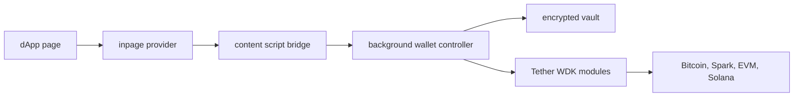

# Architecture

## Runtime Layers

## Extension Boundaries

- `entrypoints/inpage.ts` runs in the page JavaScript context, always announces the wallet through EIP-6963, and installs `window.ethereum` only when it will not overwrite an existing non-WDK provider.
- `entrypoints/content.ts` validates page message shape, rejects malformed provider payloads, and bridges valid requests to extension runtime messages.
- `entrypoints/background.ts` owns vault access, session lifetime, WDK account derivation, signing, transaction submission, and sender-tab targeting for dApp provider events without broad tab discovery permissions.
- `entrypoints/popup` renders the user-facing wallet controls.

The web page never receives the seed phrase, private key material, or direct extension storage access.

Within the background runtime, `src/lib/background/wallet-execution.ts` is the WDK execution boundary. Background controller, summary, dApp RPC, connected-site, and approval workflow modules call it for account derivation, balances, popup sends, dApp transaction validation, signing, and dApp transaction submission instead of passing session seed bytes or RPC overrides to `src/lib/wdk/client.ts` directly.

## Wallet Flow

1. User creates or imports a BIP-39 phrase from the popup.
2. The phrase is encrypted with AES-256-GCM using a PBKDF2-SHA256 key derived from the local password.
3. Only encrypted vault material is persisted to `browser.storage.local`.
4. Unlock decrypts the phrase into the background session.
5. The session expires after 10 minutes of inactivity.
6. WDK modules derive accounts and perform balances, signing, and transactions.

## Dapp Flow

1. A dapp calls `window.ethereum.request`.
2. The inpage provider posts the request to the content script.
3. The content script forwards it to the background controller.
4. The background controller checks lock state, active account, origin permissions, and supported method.
5. `eth_requestAccounts` queues an origin-scoped pending request until the user approves it from the popup Sites view.
6. Approved origins can read `eth_accounts` while the wallet is unlocked. Locked, revoked, or unknown origins receive an empty account list for passive `eth_accounts`; locking also emits `disconnect` to recorded sender tabs so dApps that ignore empty accounts can reset their session. `personal_sign` still requires an unlocked approved origin and creates a pending signature request that must be approved or rejected from the popup Sites view. Hex `personal_sign` payloads are signed as raw decoded bytes; UTF-8 text is shown when decodable, otherwise the hex string is shown.
7. The response returns through the same bridge.

Users can remove a wallet vault from extension storage through the popup delete flow (`DELETE_WALLET`), which requires the wallet password and purges encrypted vault data, transactions, and site permissions for that wallet.

Connected-site lifecycle logic is owned by `src/lib/background/connected-sites.ts`: origin normalization, connection request queueing, approval/rejection/revocation, connected-chain switching, lock/delete session-close broadcasts, and connected-session validation for dApp approvals. The module is intentionally kept together while provider methods share the same access policy and tests use its public interface; split it only if provider methods need separate access policies or tests start reaching past that interface. `src/lib/background/dapp-rpc.ts` remains the provider-method dispatcher and parser, while `src/lib/background/dapp-provider-events.ts` remains the low-level sender-targeted event transport.

Supported provider methods in this starter (see `handleDappRequest` in `src/lib/background/dapp-rpc.ts` and `DAPP_REQUEST` in `src/lib/background/messages.ts`):

| Method | Behavior |
| --- | --- |
| `eth_chainId` | Returns the connected origin's active supported EVM chain ID, defaulting to Ethereum mainnet. |
| `wallet_switchEthereumChain` | Switches an approved, unlocked origin to another pre-configured EVM chain. |
| `wallet_addEthereumChain` | Succeeds only for pre-configured WDK EVM networks; custom RPC endpoints are rejected during parameter parsing. |
| `eth_accounts` | Returns the connected account when the site is approved; returns an empty list when locked or unapproved. |
| `eth_requestAccounts` | Returns the account immediately for an approved unlocked site, rejects approved-but-locked sites, or queues origin approval in the popup Sites view. |
| `net_version`, `eth_blockNumber`, `eth_getBalance`, `eth_call`, `eth_estimateGas`, `eth_gasPrice`, `eth_feeHistory`, `eth_getTransactionCount`, `eth_getTransactionReceipt`, `eth_getCode` | Proxies validated read-only EVM RPC requests for unlocked connected origins on the origin's active supported EVM chain. `eth_call` and `eth_estimateGas` inject the connected account as `from` when omitted and reject spoofed `from` values. |
| `personal_sign` | Queues explicit Sites-view signature approval; hex payloads sign raw decoded bytes, with UTF-8 display when decodable and hex display for binary payloads. |
| `eth_signTypedData_v3` / `eth_signTypedData_v4` | Queues explicit Sites-view EIP-712 approval with structured domain/message preview and connected-chain validation. |
| `eth_sendTransaction` | Queues explicit Sites-view approval for native EVM transfers to RPC-verified externally owned accounts and decoded ERC-20 `transfer` / `approve`, Uniswap V2-style swap, Aave pool action, LayerZero OFT / USDT0-style bridge, and Safe `execTransaction` calldata after `eth_estimateGas` plus `eth_call` preflight. The pending review stores simulation status, decimal gas estimate, wallet-derived fee estimate from `eth_feeHistory` or `eth_gasPrice`, raw RPC preflight details (`eth_estimateGas`, `eth_call`, `latest` block tag), and any user-facing simulation warning. Unknown calldata, dApp gas/fee overrides, nonces, access lists, and failed preflight checks are rejected before approval. |

Unsupported methods still return `UNSUPPORTED_METHOD`. Additional provider methods should be added only with matching background validation, popup confirmation UX, tests, and security documentation.

## Pending dApp Approvals

`personal_sign`, the typed-data methods, and `eth_sendTransaction` each park a request in front of the user until it is approved or rejected from the popup Sites view. That machinery lives in one canonical store with two thin typed facades:

- `src/lib/background/pending-dapp-approvals.ts` — the public store API and mutation flow. It initializes the in-memory mirror from session storage, serializes queue/settle/reject mutations with the shared mutation chain, handles expiry and dedupe, and coordinates outcome delivery.
- `src/lib/background/pending-dapp-approval-types.ts` — the discriminated-union model (`StoredPendingApproval = StoredPendingSignature | StoredPendingDappTransaction`, discriminated by `approvalKind`) plus the shared storage-key constants.
- `src/lib/background/pending-dapp-approval-codec.ts` — parse/validate-on-load and expiry pruning for stored approvals.
- `src/lib/background/pending-dapp-approval-storage.ts` — exclusive `browser.storage.session` reads/writes for pending approvals and outcomes.
- `src/lib/background/pending-dapp-approval-transport.ts` — live waiters, the 250 ms outcome poll, and the `storage.session` `onChanged` listener that delivers outcomes to waiters in other extension contexts.
- `src/lib/background/pending-signatures.ts` and `pending-dapp-transactions.ts` — thin, statically-typed facades. Each constructs its concrete approval, calls the shared store, and unwraps its kind-specific outcome. Kind discrimination is by the `approvalKind` discriminant plus function overloads, not runtime type guards.

State persists to two `browser.storage.session` keys, both owned exclusively by the store: `wdk-wallet-dapp-approvals` (the pending array) and `wdk-wallet-dapp-approval-outcomes` (id/dedupe-keyed outcomes). Session storage is intentional — an in-flight approval should not survive a browser restart or extension update.

### Approval Store Guarantees

The starter already implements the pending-approval queue. White-label projects should call the typed signature and transaction facades instead of creating a second queue.

- **One shared queue.** Signatures and dApp transactions share the same pending-approval queue and the same session-storage keys. The `approvalKind` discriminant keeps the typed facades safe while preserving one user-facing queue.
- **Serialized mutations.** Queue, settle, reject, expiry, and cleanup operations run through `createMutationChain`, so concurrent extension events do not overwrite each other.
- **Validated session reloads.** Stored pending approvals and stored outcomes are parsed before use. Malformed entries are dropped during initialization instead of being delivered to callers.
- **Cross-context delivery.** Outcomes are written under both the approval ID and dedupe key, then delivered through live waiters, a short poll, and the `storage.session` change listener so popup/background restarts can still complete the original request.

No extra approval-store work is required for normal wallet reuse. Change this layout only if the extension intentionally moves pending approvals out of session storage or adds a second approval class with different lifetime rules.

## Transaction Monitoring

Submitted transactions are stored in extension-local storage with their chain, asset, hash, status, and timestamps. Popup state refreshes check pending transactions immediately, and the background service worker also schedules a `transaction-status-refresh` alarm every minute so EVM receipts, Solana signatures, and Bitcoin confirmations can be updated even when the popup is not actively open.

## Test Performance

Vitest defaults to the Node environment for most unit tests; UI and inpage provider tests opt into `jsdom` via `@vitest-environment` comments. `pool: "forks"` in `vitest.config.ts` keeps collection parallelizable. Keep approval, send, RPC, and multi-wallet behavior covered when changing those flows.
